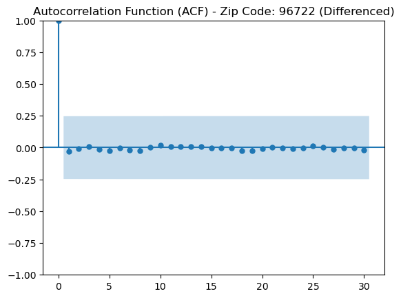
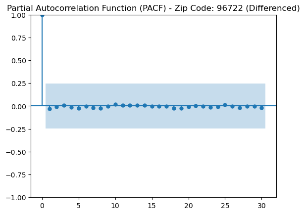

# Zillow Real Estate Investment Analysis

## Table of Contents
1. [Business Understanding](#business-understanding)
2. [Data Understanding](#data-understanding)
3. [Data Preparation](#data-preparation)
4. [Modeling](#modeling)
5. [Evaluation](#evaluation)

---

## Business Understanding
The primary objective of this project is to help stakeholders identify the top 5 zip codes in the U.S. with high potential for real estate investment. By identifying zip codes with strong, consistent growth trends, this analysis aims to provide data-driven insights for future investments. Using historical price data and forecasting models, we predict future property price trends, allowing stakeholders to assess potential growth and stability in various regions.

## Data Understanding
The dataset includes monthly historical property prices across multiple U.S. zip codes. Key features include:
- **RegionName**: Zip code, representing different regions.
- **Metro, CountyName**: Broader geographic context.
- **Price**: Monthly property prices over several years.

This data allows us to examine price trends over time and identify zip codes with stable and predictable growth, which is essential for long-term investment potential.

## Data Preparation
To ensure the data was relevant, consistent, and reflective of stable trends, several preparation steps were undertaken:

1. **Formatting and Cleaning**: We ensured consistency across all fields, especially in dates and prices, removing any missing or erroneous data. Clean, reliable data provides a solid foundation for accurate forecasting.

2. **Time Range Selection**: We focused specifically on data from **2013 to 2018**. This time range was selected to avoid the impact of the **2008-2012 housing crisis**, a period marked by significant price volatility that could skew forecasts. Using 2013-2018 data gives a more accurate and stable representation of recent growth trends, which are more predictive of future behavior.

3. **ROI Calculation**: Calculating the **Return on Investment (ROI)** for each zip code over this period (2013-2018) allowed us to rank zip codes based on their growth rates. This metric helped narrow down the top performers, as those with the highest ROI values exhibited the strongest growth potential and were prioritized for further analysis. The top 5 zip codes identified for potential investment based on ROI were:

   * **02116** - Boston, MA
   * **31527** - Brunswick, GA
   * **94803** - San Francisco, CA (El Sobrante area)
   * **96722** - Kapaa, HI
   * **96716** - Kapaa, HI (another city within the same region)

   These regions showed the most substantial growth potential, making them ideal candidates for further evaluation.

   

By following these steps, we ensured that only relevant, recent data was included in the analysis, making it more likely to reflect stable investment potential rather than temporary price fluctuations.

## Modeling

Before choosing forecasting models, we performed two key types of tests to help us understand the underlying trends in each zip code:

1. **Stationarity Tests**: For reliable forecasting, it's essential to understand if a zip code’s price data is "stationary," meaning that its statistical properties (like mean and variance) don’t change significantly over time. Using these tests, we identified which zip codes had stable price trends and which had varying trends that might need further adjustments.

2. **Seasonality Tests**: Seasonality testing helped us identify zip codes with repeating patterns over certain months or seasons. Recognizing these patterns enabled us to select a model that could accurately account for seasonal price fluctuations.

  

  

### Model Selection: ARIMA and SARIMA
Based on the results of these tests, we chose two primary forecasting models for our zip codes:

- **ARIMA (AutoRegressive Integrated Moving Average)**:
   - **Purpose**: Used for zip codes without clear seasonal patterns in price changes, ARIMA is effective at forecasting in scenarios where prices do not follow a seasonal pattern.
   - **Zip Codes Applied**: 02116, 31527, and 96722, where seasonal patterns were not evident.

<table border="1" class="dataframe">
  <thead>
    <tr style="text-align: right;">
      <th></th>
      <th>AIC</th>
      <th>BIC</th>
      <th>MAE</th>
      <th>RMSE</th>
    </tr>
  </thead>
  <tbody>
    <tr>
      <th>02116</th>
      <td>1379.544461</td>
      <td>1385.28053</td>
      <td>131429.402204</td>
      <td>154045.574038</td>
    </tr>
    <tr>
      <th>31527</th>
      <td>1205.777935</td>
      <td>1211.514004</td>
      <td>27349.179528</td>
      <td>32599.626008</td>
    </tr>
    <tr>
      <th>94803</th>
      <td>1236.576761</td>
      <td>1244.304064</td>
      <td>48187.322512</td>
      <td>57127.774485</td>
    </tr>
    <tr>
      <th>96722</th>
      <td>1264.355726</td>
      <td>1270.091795</td>
      <td>26003.485268</td>
      <td>27494.607017</td>
    </tr>
    <tr>
      <th>96716</th>
      <td>1206.292782</td>
      <td>1212.028851</td>
      <td>13214.90068</td>
      <td>14606.332226</td>
    </tr>
  </tbody>
</table>

- **SARIMA (Seasonal ARIMA)**:
   - **Purpose**: This model incorporates a seasonal component, which makes it ideal for zip codes with repeating seasonal price trends.
   - **Zip Codes Applied**: 94803 and 96716, where seasonal patterns were identified and SARIMA could leverage these patterns to provide more accurate predictions.

<table border="1" class="dataframe">
  <thead>
    <tr style="text-align: right;">
      <th></th>
      <th>AIC</th>
      <th>BIC</th>
      <th>MAE</th>
      <th>RMSE</th>
    </tr>
  </thead>
  <tbody>
    <tr>
      <th>02116</th>
      <td>2214.189736</td>
      <td>2220.080005</td>
      <td>174467.810926</td>
      <td>205148.185504</td>
    </tr>
    <tr>
      <th>31527</th>
      <td>2226.809481</td>
      <td>2232.69975</td>
      <td>187150.029666</td>
      <td>205726.753305</td>
    </tr>
    <tr>
      <th>94803</th>
      <td>1183.5849</td>
      <td>1189.260361</td>
      <td>9405.391031</td>
      <td>10256.884473</td>
    </tr>
    <tr>
      <th>96722</th>
      <td>2282.487942</td>
      <td>2288.378211</td>
      <td>303069.817641</td>
      <td>357247.531844</td>
    </tr>
    <tr>
      <th>96716</th>
      <td>1105.729437</td>
      <td>1111.619706</td>
      <td>4724.764715</td>
      <td>5217.629845</td>
    </tr>
  </tbody>
</table>

3. **Final Model - ARIMA/SARIMA Hybrid**:
   - After initial testing, it became evident that a combination of **ARIMA and SARIMA** models would best optimize the predictions. Each zip code was assigned the model that performed better for its specific data characteristics. For zip codes with stable seasonal patterns, SARIMA provided better accuracy, while for others, ARIMA was sufficient. This hybrid approach allowed us to leverage each model's strengths, applying ARIMA where simplicity and accuracy were beneficial and SARIMA where seasonal consistency improved prediction quality.

<table border="1" class="dataframe">
  <thead>
    <tr style="text-align: right;">
      <th></th>
      <th>AIC</th>
      <th>BIC</th>
      <th>MAE</th>
      <th>RMSE</th>
      <th>ROI (%)</th>
    </tr>
  </thead>
  <tbody>
    <tr>
      <th>02116</th>
      <td>1379.544461</td>
      <td>1385.28053</td>
      <td>131429.402204</td>
      <td>154045.574038</td>
      <td>0.126311</td>
    </tr>
    <tr>
      <th>31527</th>
      <td>1205.777935</td>
      <td>1211.514004</td>
      <td>27349.179528</td>
      <td>32599.626008</td>
      <td>0.257387</td>
    </tr>
    <tr>
      <th>94803</th>
      <td>1183.5849</td>
      <td>1189.260361</td>
      <td>9405.391031</td>
      <td>10256.884473</td>
      <td>13.357224</td>
    </tr>
    <tr>
      <th>96722</th>
      <td>1264.355726</td>
      <td>1270.091795</td>
      <td>26003.485268</td>
      <td>27494.607017</td>
      <td>0.017283</td>
    </tr>
    <tr>
      <th>96716</th>
      <td>1105.729437</td>
      <td>1111.619706</td>
      <td>4724.764715</td>
      <td>5217.629845</td>
      <td>1.565792</td>
    </tr>
  </tbody>
</table>

## Evaluation
Each model’s performance was evaluated using these metrics:
- **Mean Absolute Error (MAE)**: Shows the average prediction error; lower values indicate more accurate predictions.
- **Root Mean Squared Error (RMSE)**: Gives more weight to larger errors, helping to understand the consistency of the model’s predictions.
- **AIC/BIC Scores**: These scores provide a measure of model fit, with lower scores indicating better performance on the data.
- **ROI**: The ROI was calculated from the newly forecasted prices, providing another valuable tool in identifying top zip codes for future investment.

### Key Findings
- **94803 (El Sobrante, CA)** and **96716 (Hanapepe, HI)**: Using the SARIMA model, these zip codes demonstrated the most accurate and stable forecasts along with the highest ROI's, suggesting a strong potential for reliable, long-term growth.
- **Other Zip Codes (02116, 31527, and 96722)**: ARIMA provided effective predictions for these areas, though less stability was observed in seasonal patterns, indicating potentially higher short-term price volatility.

### Final Recommendation
Based on the analysis, **94803 and 96716** stand out as the top zip codes for investment, given their consistent, predictable growth trends under the SARIMA model. These areas are recommended for investors seeking stable, seasonally-influenced returns. For **02116, 31527, and 96722**, ARIMA offers valuable insights but indicates a potential for more price fluctuations, making these regions better suited for investors open to a moderate level of risk in exchange for potentially higher returns.

By combining ARIMA and SARIMA, this hybrid approach optimized forecast accuracy, providing reliable insights to aid stakeholders in data-driven, strategic investment decisions.
